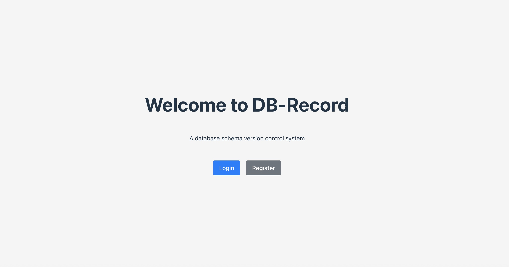
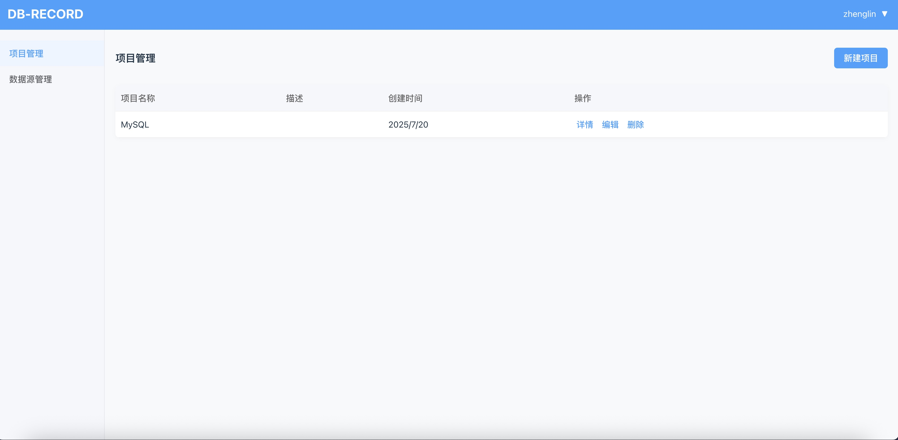
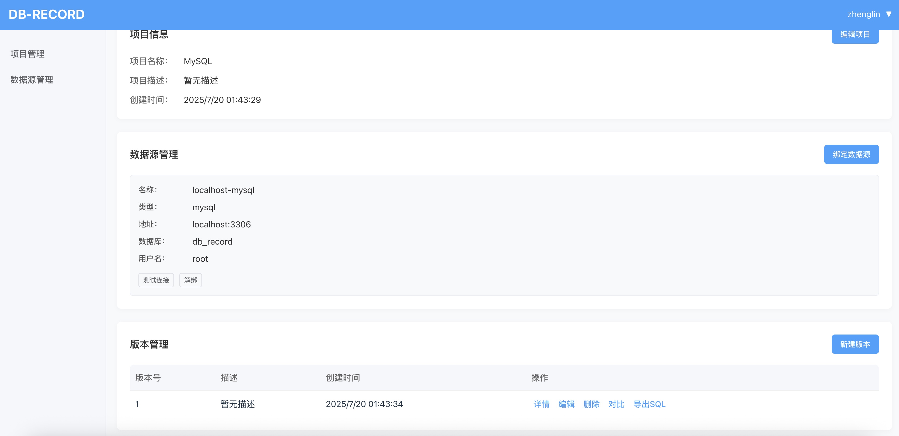
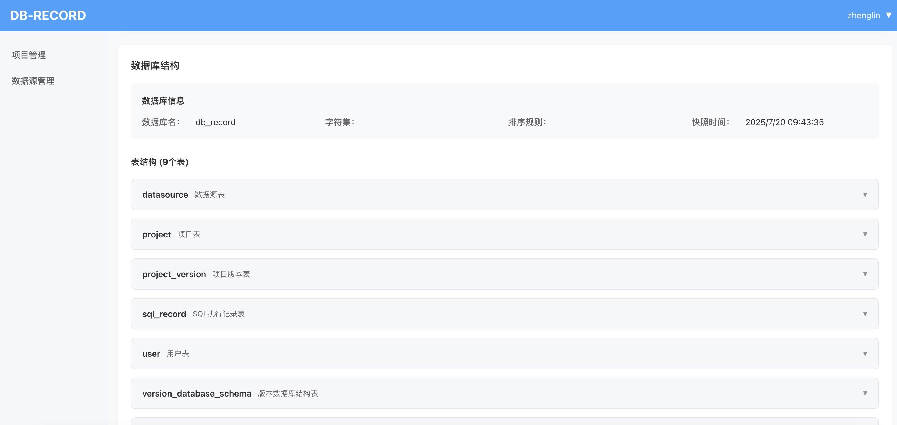
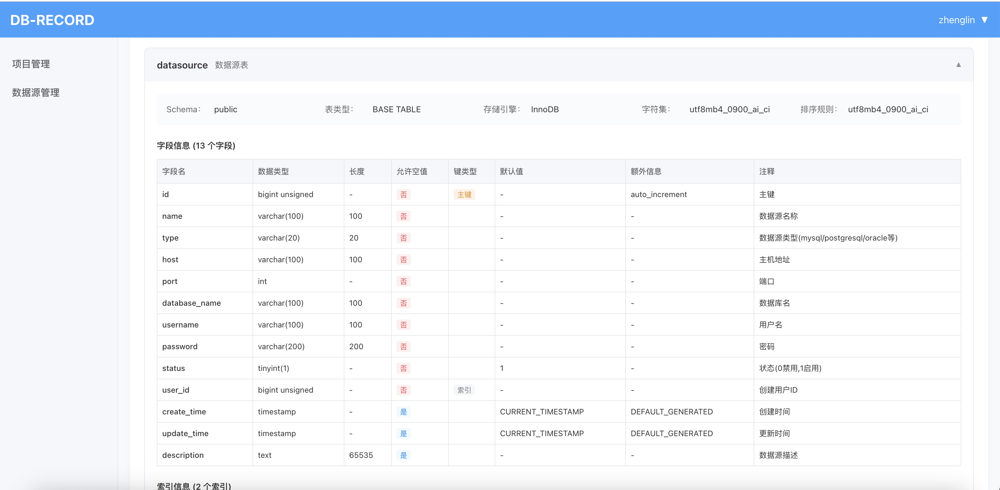
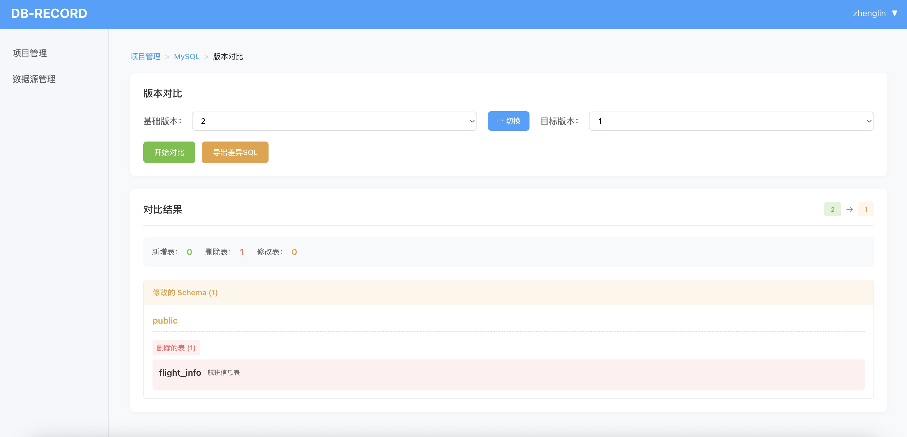
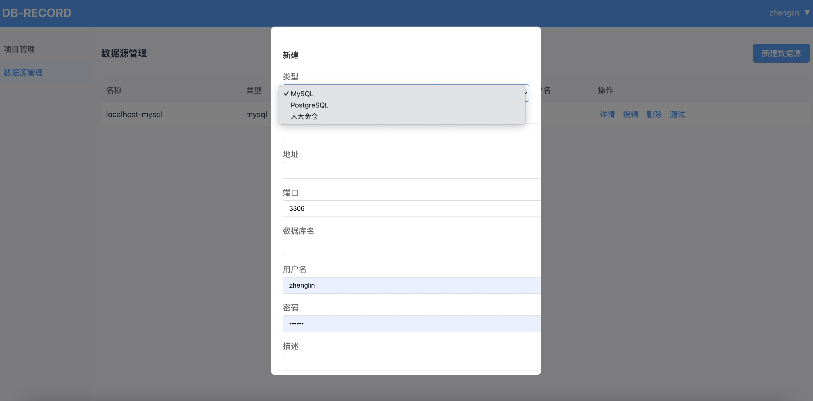

# Database Structure Change Recorder

[中文 (Chinese Version)](README_zh.md)

This project records changes in database structures, including databases, tables, fields, indexes, and foreign keys.

Through the web interface, you can create projects, execute SQL statements in the project console, record those statements, tag project versions, and view structural changes before each tag.

## Project Structure
- **frontend**
    - Framework: Vue 3
    - UI: Element Plus
    - Routing: vue-router
    - State Management: Pinia
    - Charts: ECharts
- **backend**
    - Framework: Java Spring Boot (JDK 17)
    - Database: MySQL

## Main Features

### Authentication
- Login page
- Login API
- Login validation
- Redirect to project management page after successful login

### Project Management
- Project list
- Project details
- Project creation
- Project deletion
- Project version management
    - Version list
    - Version details
    - Version creation (captures current database, tables, fields, indexes, foreign keys, and records them in the version)
    - Version deletion
    - Version comparison (shows structural changes between selected versions, exportable as SQL files)

### Datasource Management
- Datasource list
- Datasource details
- Datasource creation
- Datasource deletion
- Datasource editing
- Datasource testing
- Datasource connection

#### Supported Datasources
- MySQL (default)
- PostgreSQL
- KingbaseES

## API Response Convention
All API responses are wrapped using the `Result` class (`backend/src/main/java/com/dbrecord/util/Result.java`).

## Development & Contribution
- Please refer to `.gitignore` in the root, backend, and frontend directories for best practices.
- For change history, see `CHANGELOG.md` if available.
- For backend and frontend specific setup, see their respective `README.md` files in each directory.

## License
Please add a LICENSE file if you intend to open source this project.

---
[中文](README_zh.md)
