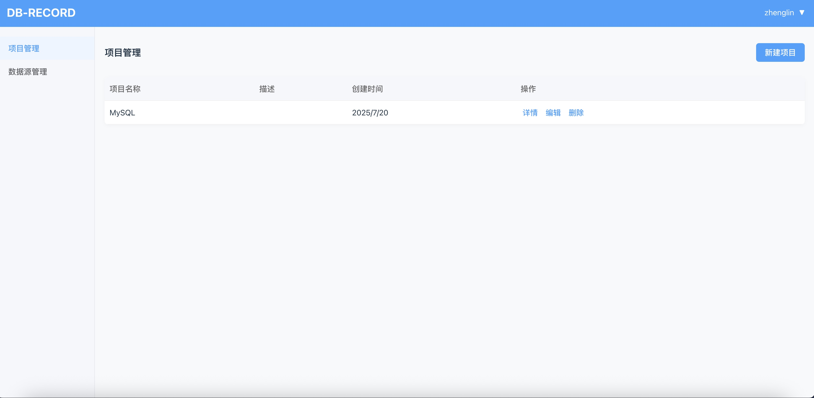

# 数据库结构变化记录

[English](README.md)

本项目用于记录数据库结构的变化，包括库、表、字段、索引、外键等。

通过 Web 页面，您可以新建项目，在项目控制台输入并执行 SQL 语句，记录这些语句，对项目打 tag，并查看每个 tag 之前的结构变化。

## 项目结构
- **frontend 前端**
    - 框架：Vue 3
    - UI：Element Plus
    - 路由：vue-router
    - 状态管理：Pinia
    - 图表：ECharts
- **backend 后端**
    - 框架：Java Spring Boot (JDK 17)
    - 数据库：MySQL

## 主要功能

### 登录认证
- 登录页面
- 登录接口
- 登录验证
- 登录成功后跳转至项目管理页面

### 项目管理
- 项目列表
- 项目详情
- 项目创建
- 项目删除
- 项目版本管理
    - 版本列表
    - 版本详情
    - 版本创建（会采集当前库、表、字段、索引、外键等结构，并记录到版本中）
    - 版本删除
    - 版本对比（展示所选版本之间的结构变化，可导出为 SQL 文件）

### 数据源管理
- 数据源列表
- 数据源详情
- 数据源创建
- 数据源删除
- 数据源编辑
- 数据源测试
- 数据源连接

#### 支持的数据源
- MySQL（默认）
- PostgreSQL
- 人大金仓（KingbaseES）

## API 返回规范
所有接口返回均封装为 `Result` 类（`backend/src/main/java/com/dbrecord/util/Result.java`）。

## 开发与贡献
- 请参考根目录、backend、frontend 目录下的 `.gitignore` 文件以遵循最佳实践。
- 变更历史请参见 `CHANGELOG.md`（如有）。
- 后端和前端的具体使用说明请参见各自目录下的 `README.md` 文件。

## 许可证
如需开源，请添加 LICENSE 文件。

---
[English](README.md) 